<p align="center">
  
</p>

```console
walid@usthb:~$ cat about.txt
I build secure, scalable backend systems with a focus on clean architecture,
API design, distributed workflows, and database-driven applications.

My work spans .NET Core, NestJS, FastAPI, Kafka/NATS messaging, Redis caching,
and Dockerized environments, plus modern frontend stacks when the product needs
a complete end-to-end build.
```

```console
walid@usthb:~$ committers --rank --country algeria
```

<p align="center">
  <a href="https://user-badge.committers.top/algeria_private/walidozich"></a>
</p>

<pre>
walid@usthb:~$ ./connect.sh --list
<b>[1]</b> portfolio   ->  <a href="https://portfolio-walidozich.netlify.app">portfolio-walidozich.netlify.app</a>
<b>[2]</b> linkedin    ->  <a href="https://www.linkedin.com/in/mohamed-walid-cherchali-204771217/">in/mohamed-walid-cherchali</a>
<b>[3]</b> github      ->  <a href="https://github.com/walidozich">github.com/walidozich</a>
<b>[4]</b> email       ->  <a href="mailto:cherchalimohamedwalid@gmail.com">cherchalimohamedwalid@gmail.com</a>
<b>[5]</b> instagram   ->  <a href="https://instagram.com/walidozich">@walidozich</a>

5 channels open. pick one, i usually answer fast.
</pre>

```console
walid@usthb:~$ tree ~/stack --noreport
/home/walid/stack
├── languages/      C  C#  C++  Java  JavaScript  Python  HTML5  CSS3
├── backend/        .NET Core  NestJS  FastAPI  Express.js  Django  Node.js  OpenAPI
├── distributed/    Apache Kafka  NATS  Redis  BullMQ
├── databases/      PostgreSQL  MySQL  MongoDB  Prisma  Entity Framework
├── frontend/       Next.js  React Native  TailwindCSS
└── devops+sec/     Docker  Docker Compose  Linux  Git  GitHub  JWT  OAuth2  RBAC
walid@usthb:~$ ls ~/stack --icons
```

<p align="center">
  <br/>
  
</p>

```console
walid@usthb:~$ gh stats --user walidozich --watch
fetching contributions from api.github.com ... done
```

<p align="center">
  <a href="https://git.io/streak-stats"></a>
  
</p>

```console
walid@usthb:~$ fortune -s dev
```

<p align="center">
  
</p>

```console
walid@usthb:~$ exit
logout
Connection to github.com closed.
```
